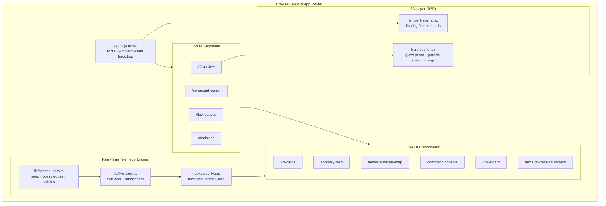
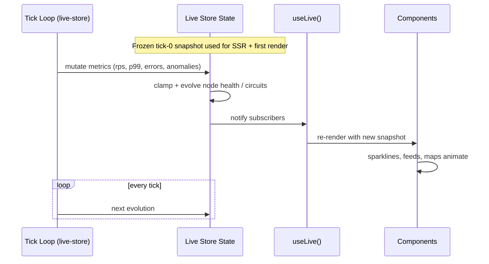
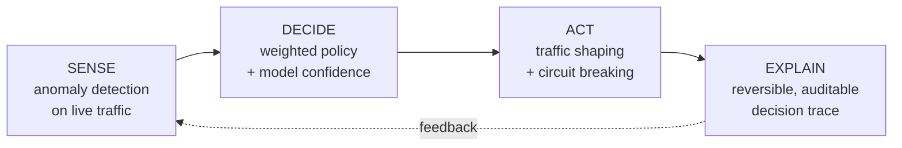

# Sentinel Gateway

> An intelligent, self-aware API gateway with **real-time anomaly detection**, **adaptive traffic shaping**, and **self-healing circuit breaking** — visualized as a living nervous system.

Sentinel Gateway is a demonstration product experience built from a full PRD, Technical, and Design specification. It pairs a cinematic **3D landing page** (React Three Fiber) with three operational surfaces — a **Command Center**, a **Flow Canvas**, and a **Decision Explainer** — all driven by a single **real-time telemetry engine** so every metric, sparkline, node, and feed updates live.

---

## Table of Contents

- [Highlights](#highlights)
- [Screens](#screens)
- [Tech Stack](#tech-stack)
- [System Architecture](#system-architecture)
- [Real-Time Data Flow](#real-time-data-flow)
- [The Control Loop](#the-control-loop)
- [File Structure](#file-structure)
- [Getting Started](#getting-started)
- [Design System](#design-system)

---

## Highlights

- **Genuine real-time data** — a client-side telemetry engine (`lib/live-store.ts`) evolves every metric on a fixed tick and broadcasts to React via `useSyncExternalStore`. No static numbers, no fake charts.
- **True 3D, not images** — the hero renders a refractive glass prism, a flowing particle stream, and coral orbital rings with React Three Fiber; a subtle ambient 3D field sits behind every page.
- **Hydration-safe** — a frozen tick-0 snapshot is used for SSR and first client render, so live randomness never causes hydration mismatches.
- **Interactive operations** — select nodes on the nervous-system map, tune traffic budgets on the Flow Canvas, and inspect reversible AI decisions in the X-Ray Inspector.
- **Cohesive design language** — pearl-white surfaces, deep-indigo type, bioluminescent-cyan accents, and coral/amber signals, per the Design Document.

---

## Screens

| Route | Name | What it does |
| --- | --- | --- |
| `/` | **Overview** | 3D "Elevate Your API Intelligence" hero, live stat bar, feature grid, and the sense → decide → act → explain control loop. |
| `/command-center` | **Nervous System Map** | Live KPIs with sparklines, interactive service topology, node inspector, and a streaming anomaly feed. |
| `/flow-canvas` | **Flow Canvas** | Adaptive traffic-shaping policies with editable capacity budgets and live cluster-capacity readout. |
| `/decisions` | **X-Ray Inspector** | Glass-box decision explainer: weighted reasoning trace, live model confidence, and reversible operator controls. |

---

## Tech Stack

- **Framework** — Next.js (App Router) + React
- **Language** — TypeScript
- **Styling** — Tailwind CSS v4 + shadcn/ui + custom design tokens
- **3D** — three.js via `@react-three/fiber` and `@react-three/drei`
- **State** — a custom external store consumed with `useSyncExternalStore`
- **Icons** — lucide-react

---

## System Architecture



---

## Real-Time Data Flow



---

## The Control Loop

Sentinel's intelligence is a closed loop — the same story the landing page tells and the app demonstrates.



---

## File Structure

```txt
sentinel-gateway/
├── app/
│   ├── layout.tsx              # Root layout: fonts, metadata, ambient 3D backdrop
│   ├── globals.css             # Tailwind v4 + design tokens (pearl/indigo/cyan/coral/amber)
│   ├── page.tsx                # Overview (landing) page
│   ├── command-center/
│   │   └── page.tsx            # Nervous System Map command center
│   ├── flow-canvas/
│   │   └── page.tsx            # Adaptive traffic-shaping canvas
│   └── decisions/
│       └── page.tsx            # X-Ray decision explainer
│
├── components/
│   ├── site-nav.tsx            # Glass navbar with routing
│   ├── sentinel-logo.tsx       # Brand mark
│   ├── page-header.tsx         # Shared page header
│   ├── sparkline.tsx           # Prop-driven live sparkline
│   ├── nervous-system-map.tsx  # Interactive service topology (live)
│   ├── three/
│   │   ├── hero-scene.tsx      # 3D hero: glass prism, particle stream, coral rings
│   │   └── ambient-scene.tsx   # 3D ambient backdrop for every page
│   ├── landing/
│   │   ├── hero-section.tsx    # Headline, CTAs, live stat bar, 3D mount
│   │   ├── feature-grid.tsx    # Feature cards with live micro-stats
│   │   ├── closed-loop.tsx     # Sense/Decide/Act/Explain section
│   │   └── cta-footer.tsx      # Closing CTA + footer
│   ├── command/
│   │   ├── kpi-cards.tsx       # Live KPI tiles with sparklines
│   │   ├── anomaly-feed.tsx    # Streaming anomaly feed (live timestamps)
│   │   └── command-console.tsx # Map + live node inspector
│   ├── flow/
│   │   └── flow-board.tsx      # Editable budgets over live load
│   └── decisions/
│       ├── decision-summary.tsx# Live confidence + protected-request count
│       └── decision-trace.tsx  # Weighted reasoning trace
│
├── hooks/
│   └── use-live.ts             # useSyncExternalStore binding to the engine
│
└── lib/
    ├── live-store.ts           # Real-time telemetry engine (tick loop)
    ├── sentinel-data.ts        # Types + seed nodes / edges / policies / anomalies
    └── utils.ts                # cn() class merge helper
```

---

## Getting Started

```bash
# install dependencies
pnpm install

# run the dev server
pnpm dev

# open http://localhost:3000
```

Build for production:

```bash
pnpm build
pnpm start
```

---

## Design System

| Token | Role | Value |
| --- | --- | --- |
| Background | Pearl white surfaces | `#eef3fb` / `#f4f6fb` |
| Foreground | Deep indigo text | `#1a237e` family |
| Accent | Bioluminescent cyan | `#22c3e6` |
| Signal | Coral (stress / alerts) | coral / red |
| Signal | Amber (warnings) | amber |

- **Typography** — Geist (sans) for UI, Geist Mono for metrics and code.
- **Surfaces** — glassmorphism: translucent panels, soft borders, blur.
- **Motion** — subtle pulse on live indicators; continuous 3D drift.

---

<p align="center"><em>See your traffic think.</em></p>
