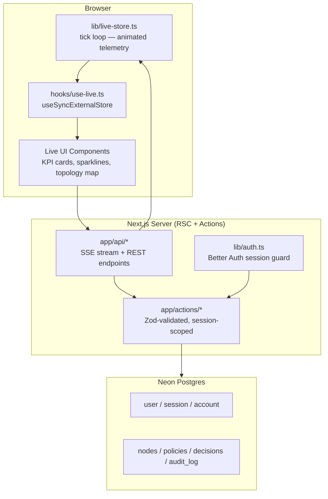
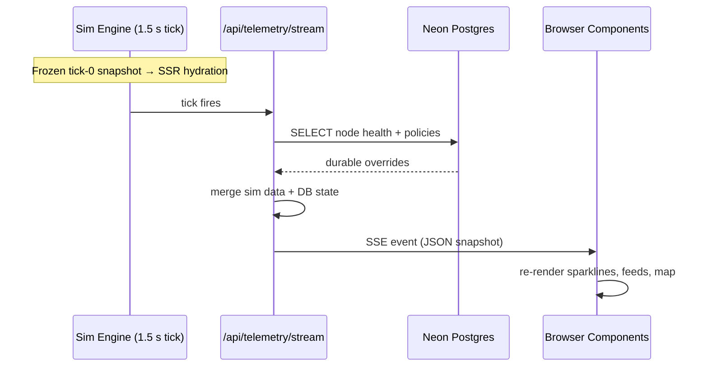

# Sentinel Gateway

> **See your traffic think.**
> A self-aware, production-grade API Gateway that detects, decides, acts, and explains — in under 300 ms.

[](https://sentinalgateway.vercel.app)
[](https://nextjs.org)
[](https://neon.tech)
[](https://better-auth.com)

---

## What is Sentinel Gateway?

Sentinel Gateway is an intelligent API control plane that wraps your microservices in a closed-loop intelligence layer. Instead of passively forwarding traffic, it continuously monitors every service, detects emerging anomalies before they cascade, shapes load in real time, and produces a full, reversible audit trail of every autonomous decision it makes.

The result: **incidents are contained in milliseconds, not minutes — and your on-call engineer reads a post-incident report, not a pager alert.**

---

## The Four-Capability Loop

```
SENSE ──► DECIDE ──► ACT ──► EXPLAIN
  ▲                              │
  └──────────────────────────────┘
         closed-loop feedback
```

| Phase | What happens | Latency |
|---|---|---|
| **Sense** | Bayesian anomaly detection on p99, error rate, and RPS deltas | < 40 ms |
| **Decide** | Policy engine weighs circuit-breaker vs. adaptive shedding vs. backpressure | < 200 ms |
| **Act** | Circuit opens, traffic sheds, or retry buffers engage — zero human input | < 300 ms |
| **Explain** | Full weighted-reasoning trace logged; operator can approve or one-click rollback | instant |

---

## Live Stats (real-time on the dashboard)

| Metric | Typical value | What it means |
|---|---|---|
| Requests / sec | ~131k | Total inbound RPS across all services |
| Global p99 | ~97 ms | 99th-percentile end-to-end latency |
| Error rate | ~1.66% | End-user visible errors (circuit-open traffic excluded) |
| Decision confidence | 96% | SentinelBrain-v3 model certainty on last autonomous action |
| Requests protected | 312k+ | Requests shielded from cascading failures since last incident |

---

## Application Screens

| Route | Name | Description |
|---|---|---|
| `/` | **Overview** | Cinematic 3D landing page — glass prism + particle stream hero, live stat bar, feature grid, and the closed-loop explainer. |
| `/command-center` | **Command Center** | Real-time KPI cards with sparklines, interactive service topology map, node inspector with Apply Mitigation / Snooze / Reset, and a live anomaly feed. |
| `/flow-canvas` | **Flow Canvas** | Visual traffic-shaping policy editor. Tune capacity budgets per service, create new policies, and deploy changes — all persisted to Neon Postgres. |
| `/decisions` | **Decision Explainer** | Glass-box AI decision inspector. Weighted reasoning trace, live model confidence, and one-click Approve or Roll Back with a full audit log export. |

---

## Production-Grade Backend

This is not a demo with localStorage. Every operator action is durable.

### Database — Neon Postgres (9 tables)

| Table | Purpose |
|---|---|
| `user`, `session`, `account`, `verification` | Better Auth — operator identity and sessions |
| `service_nodes` | Persistent health and circuit state for each gateway node |
| `shaping_policies` | Durable traffic-shaping policy definitions |
| `decisions` | AI-generated gateway decisions with outcomes |
| `decision_steps` | Per-step reasoning trace for the explainer UI |
| `audit_log` | Tamper-evident log of every sentinel and operator action |

### Authentication — Better Auth

- Email + password authentication for operators
- Session cookies with `sameSite: none` + `secure: true` for v0 preview iframe compatibility
- Full `trustedOrigins` cascade: local dev → Vercel preview → Vercel production
- All inner routes (`/command-center`, `/flow-canvas`, `/decisions`) redirect unauthenticated visitors to `/sign-in`

### Server Actions (Zod-validated, session-scoped)

```
app/actions/
  policies.ts    — getPolicies, createPolicy, updatePolicy, deletePolicy
  decisions.ts   — getDecisions, applyDecisionAction (approve / rollback)
  nodes.ts       — applyNodeAction (mitigate / snooze / reset)
  audit.ts       — getAuditLog (JSON or CSV export)
```

### API Routes (all Neon-backed)

| Endpoint | Method | Description |
|---|---|---|
| `/api/telemetry/stream` | GET SSE | Real-time stream merging live simulation + DB-persisted node health |
| `/api/nodes` | GET | Current node list from Neon |
| `/api/nodes/[id]/action` | POST | Persist operator mitigation action |
| `/api/policies` | GET, POST | List and create shaping policies |
| `/api/policies/[id]` | PATCH, DELETE | Update or remove a policy |
| `/api/decisions` | GET | Decision list with full step traces |
| `/api/decisions/[id]/action` | POST | Approve or roll back a decision |
| `/api/audit` | GET | Full audit log (JSON or `Accept: text/csv` for download) |

---

## Tech Stack

| Layer | Technology |
|---|---|
| Framework | Next.js 16 — App Router, React Server Components, Server Actions |
| Language | TypeScript (strict) |
| Database | Neon Postgres via Drizzle ORM (`drizzle-orm/node-postgres`) |
| Auth | Better Auth (email + password, pg Pool shared with Drizzle) |
| Validation | Zod |
| Styling | Tailwind CSS v4 + custom design tokens |
| 3D | React Three Fiber + Drei (glass prism, particle stream, orbital rings) |
| Real-time | `useSyncExternalStore` bound to a client-side telemetry simulation engine |
| Icons | lucide-react |

---

## System Architecture



---

## Real-Time Data Flow



---

## File Structure

```
sentinel-gateway/
├── app/
│   ├── layout.tsx              # Root layout: fonts, AmbientScene backdrop
│   ├── globals.css             # Tailwind v4 + design tokens
│   ├── page.tsx                # Overview landing page
│   ├── sign-in/page.tsx        # Operator sign-in (Better Auth)
│   ├── sign-up/page.tsx        # Operator sign-up (Better Auth)
│   ├── actions/
│   │   ├── policies.ts         # Policy CRUD server actions
│   │   ├── decisions.ts        # Decision approve/rollback actions
│   │   ├── nodes.ts            # Node mitigation actions
│   │   └── audit.ts            # Audit log read actions
│   ├── api/
│   │   ├── auth/[...all]/      # Better Auth catch-all handler
│   │   ├── telemetry/stream/   # SSE: sim + DB merged stream
│   │   ├── nodes/              # REST: node list + action
│   │   ├── policies/           # REST: policy CRUD
│   │   ├── decisions/          # REST: decision list + action
│   │   └── audit/              # REST: audit log + CSV export
│   ├── command-center/page.tsx # Nervous System Map (session-guarded)
│   ├── flow-canvas/page.tsx    # Traffic shaping canvas (session-guarded)
│   └── decisions/page.tsx      # Decision explainer (session-guarded)
│
├── components/
│   ├── site-nav.tsx            # Glass navbar — user chip + sign-out
│   ├── auth-form.tsx           # Shared sign-in / sign-up form
│   ├── sign-out-button.tsx     # Client-side sign-out via authClient
│   ├── live-metrics-bar.tsx    # Live RPS / p99 / error bar (inner routes)
│   ├── three/
│   │   ├── hero-scene.tsx      # 3D glass prism + particles + rings
│   │   └── ambient-scene.tsx   # 3D ambient backdrop
│   ├── landing/
│   │   ├── hero-section.tsx    # Headline, CTAs, live stat bar
│   │   ├── feature-grid.tsx    # Feature cards with live micro-stats
│   │   ├── closed-loop.tsx     # Sense / Decide / Act / Explain
│   │   └── cta-footer.tsx      # Closing CTA
│   ├── command/
│   │   ├── kpi-cards.tsx       # Live KPI tiles with sparklines
│   │   ├── anomaly-feed.tsx    # Streaming anomaly feed
│   │   ├── command-console.tsx # Topology map + node inspector
│   │   └── freeze-button.tsx   # Pause/resume the sim engine
│   ├── flow/
│   │   ├── flow-board.tsx      # Policy editor (DB-backed)
│   │   └── new-policy-modal.tsx# Create policy modal with validation
│   └── decisions/
│       ├── decision-summary.tsx# Live confidence + Approve / Roll Back
│       ├── decision-trace.tsx  # Weighted reasoning steps (from DB)
│       └── export-audit-button.tsx # Download audit log as CSV
│
├── hooks/
│   └── use-live.ts             # useSyncExternalStore → sim engine
│
└── lib/
    ├── auth.ts                 # Better Auth config (trustedOrigins + cookie fix)
    ├── auth-client.ts          # Better Auth React client
    ├── live-store.ts           # Real-time simulation engine
    ├── sentinel-data.ts        # Seed types + data
    ├── db/
    │   ├── index.ts            # Drizzle client + shared pg Pool
    │   └── schema.ts           # Better Auth tables + 5 app tables
    └── utils.ts                # cn() helper
```

---

## Getting Started

### Prerequisites

- Node.js 20+
- pnpm
- A [Neon](https://neon.tech) Postgres database
- A `BETTER_AUTH_SECRET` (generate with `openssl rand -base64 32`)

### Environment Variables

```env
DATABASE_URL=postgresql://...      # Neon connection string
BETTER_AUTH_SECRET=...             # Random 32+ char secret
```

### Setup

```bash
# Install dependencies
pnpm install

# Push DB schema (creates all 9 tables)
pnpm exec drizzle-kit push

# Run the dev server
pnpm dev
```

Open [http://localhost:3000](http://localhost:3000), sign up for an operator account, and you're in.

### Production Build

```bash
pnpm build
pnpm start
```

---

## Design System

| Token | Role | Value |
|---|---|---|
| `--background` | Pearl-white surface | `#eef3fb` |
| `--foreground` | Deep-indigo text | `#1a237e` family |
| `--primary` | Primary actions | `#1a237e` |
| `--cyan` | Bioluminescent live indicators | `#22c3e6` |
| `--coral` | Stress / circuit-open signals | coral |
| `--amber` | Warning-level signals | amber |

- **Typography** — Geist Sans for UI copy; Geist Mono for all numeric metrics and code.
- **Surfaces** — glassmorphism throughout: translucent panels, soft `border-border`, `backdrop-blur`.
- **Motion** — sentinel-pulse keyframe on all live indicators; continuous 3D drift on the ambient scene.

---

## Contributing

1. Fork the repo
2. Create a feature branch: `git checkout -b feat/your-feature`
3. Commit with a conventional commit message
4. Open a pull request against `main`

---

<p align="center">
  <strong>Sentinel Gateway</strong> — <em>See your traffic think.</em>
</p>
